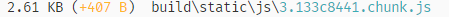

<div align="center">

# React-lite-toast [](https://www.npmjs.com/package/react-lite-toast) [](https://standardjs.com)
 

</div>

A minimal toast notification for react with a bundled size of 3 kB ⚡.

[Live Demo](https://ajin.dev/react-lite-toast-home/)
 
## UI
<div align="center">

 
  

</div>


## Install

```bash
npm install --save react-lite-toast
```
or
```bash
yarn add react-lite-toast
```

## Usage

```tsx
import React, { useState } from 'react'
import { Toast } from 'react-lite-toast'
import 'react-lite-toast/dist/index.css'

const App = () => {
  const [toast, setToast] = useState(false)
  return (
    <div>
      <button onClick={() => setToast(!toast)}>Click me</button>
      {toast && <Toast type="success" title="Completed" description="Flippity flip" position="bottomup" />}
    </div>
  )
}

export default App
```
or

```tsx
import React, { Component } from "react";
import { Toast } from "react-lite-toast";
import "react-lite-toast/dist/index.css";

class App extends Component {
  state = {
    toast: false
  };

  setToast = () => {
    this.setState(prevState => ({
      toast: !prevState.toast
    }));
  };

  render() {
    return (
      <>
        <button onClick={() => this.setToast()}>Click me</button>
        {this.state.toast && (
          <Toast
            type="success"
            title="Completed"
            description="Flippity flip"
            position="bottomup"
          />
        )}
      </>
    );
  }
}

export default App;
```

## Props

| Prop                               | Description                                                        |
| ---------------------------------- | ------------------------------------------------------------------ |
| type `string`                      | Required. One of `success`, `error`, `warning`, `info`             |
| title `string`                     | Required. The title of the toast notifaction.                      |
| description `string `              | Required: The content of the toast notification                    |
| position: `string    `             | Required. One of `bottomup`, `topdown`, `topleft`, `topright`,`bottomleft`, `bottomright`          |
 

## Contributors

- [Ajin Kabeer](https://github.com/ajinkabeer)


## License

MIT © [ajinkabeer](https://github.com/ajinkabeer)
